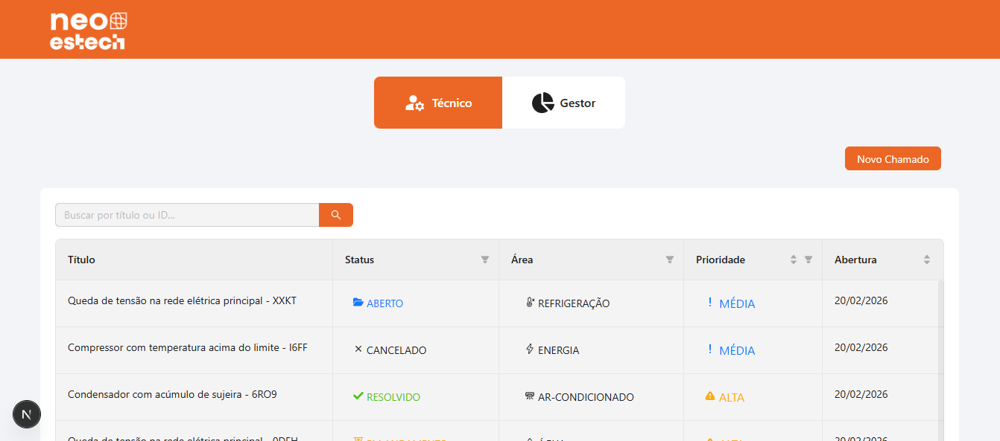
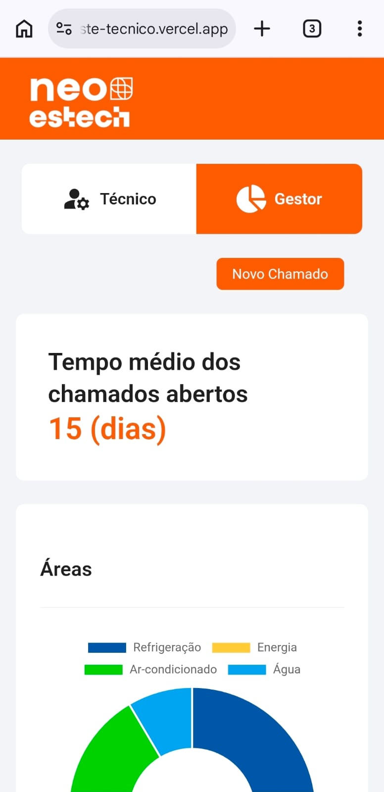
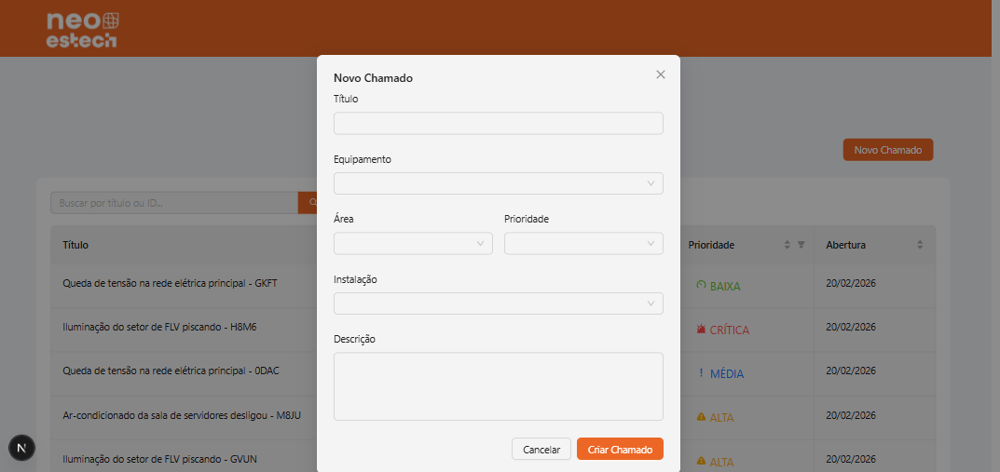
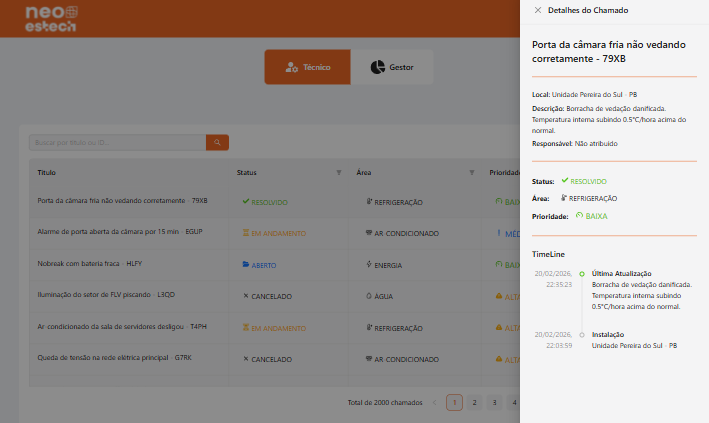
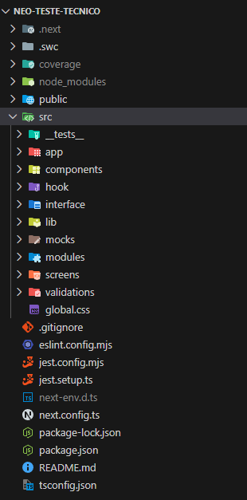

# **Teste Técnico - Neo Estech**

## Como rodar o projeto :checkered_flag:
Após o clone do projeto execute os seguinte comandos

    npm install
    npm run dev

Ou acesse o projeto no [link do projeto na vercel](https://neo-teste-tecnico.vercel.app/tecnico) pelo navegador desktop ou mobile.

## Arquitetura/UX :computer:
1. Uma das abordagens de UX que decidi aplicar, foi criar um componente chamado **ToggleViews**, com o objetivo de gerenciar as telas para **Técnicos** e **Gestor**. A aplicação iniciara por padrão na roda **/tecnico**, onde será possivel navergar por essas duas telas clicando nos botões **Técnico/Gestor**.

2. O botão **Novo Chamado** está presente nas duas telas e ao clicar nela será exibido um modal para criar um novo chamado.

No item obrigátorio **nº5** foi solicitado cadastrar as informações **(título, área, prioridade, descrição, equipamento)**, porém durante o desenvolvimento houve a necessidade de adicionar o campo **instalação**. Porque quando clicamos em uma linha da tabela, selecionamos aquela linha e exbimos as informações totais no **Drawer** junto com uma exibição de **TimeLine**. Onde o componente apresentava um erro por falta dessa informação, além de ser uma informação necessária para o usuário identificar a origem do chamado.

3. Sobre a arquitetura foi utilizado o conceito de **Atomic Design**, que consiste em criar componentes menores e ir agregando eles em partes maiores do sistema. 
**Exemplo:** 

    Page: TechnicalPage > Screen: Technical > Module: TechnicalView > component: StatusBadge.

    Seguindo do **maior componente para o menor componente**, isso tonará o encapsulamento e responsabilidades de cada componente mais simples a medida que a aplicação cresce e novas *fetures* sejam acrescentadas.

    

##  O que você faria diferente com mais tempo :rocket:

1. Eu finalizaria a cobertura dos testes em toda aplicação.
2. Trocaria a visualização de tabela nos dispositivos mobile por conta da largura, poderia ser uma vizualização por meio de cards que sejam mais intuitivos para o técnico/gestor.

## Respostas conceituais :question:

1.  **Cache e mutação:**  Você tem a lista de chamados carregada via React Query com filtros ativos (status = "Aberto", área = "Refrigeração"). O usuário cria um novo chamado pelo formulário. Como você garante que a lista reflita o novo item imediatamente, sem refetch completo de todos os filtros? Descreva sua estratégia (optimistic update, invalidação seletiva, ou outra).

    **Resposta:** Utilizando o método **setQueriesData** do **React-Query** para termos acesso a toda  lista de dados que esta em cache e adicionar um novo elemento no incio da lista, evitando um refetch para o servidor:
` queryClient.setQueriesData({ queryKey: ['mocks'] }, (oldData:  Imock |  undefined) => {})`

3.  **Performance:**  Uma tabela de equipamentos com 5.000 linhas e 15 colunas está demorando 3 segundos para renderizar e trava ao filtrar. O usuário é um técnico de campo usando celular Android médio. Descreva, em ordem de prioridade, as abordagens que você aplicaria para resolver.

    **Resposta:** Para isso vou adotar a abordagem de **paginação Server-side**, que consiste diminuir o payload da rede e o consumo de memória do cliente. Isso Também ajudará a perfomance da UI, já que o DOM irá renderizar uma quantidade menor de elementos.

4.  **Arquitetura de componentes:**  Você criou um  `<StatusBadge />`  usado em 4 telas diferentes. Em uma tela ele precisa exibir um tooltip, em outra precisa abrir um dropdown ao clicar, e em uma terceira é apenas visual. Como você projeta esse componente para ser reutilizável sem virar um "mega-componente" cheio de props condicionais?

    **Resposta:** O `<StatusBadge />` seria um componente 'burro' focado apenas em estilo. Para evitar o mega-componente, eu aplicaria a **Inversão de Controle**: se o badge precisa de um Tooltip, eu o envolvo em um `<Tooltip />`. Tecnicamente, implementaria o Badge usando **forwardRef** e garantiria que ele repasse as **rest props** para o elemento DOM. Isso é vital para que componentes de comportamento (como os do Radix UI) consigam injetar eventos de clique e hover sem que o Badge precise ter propriedades específicas para cada contexto.
